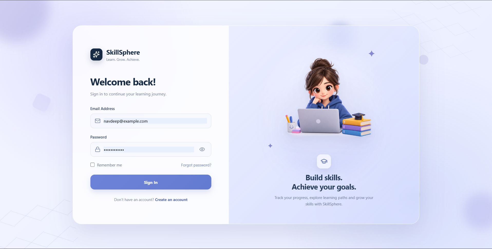
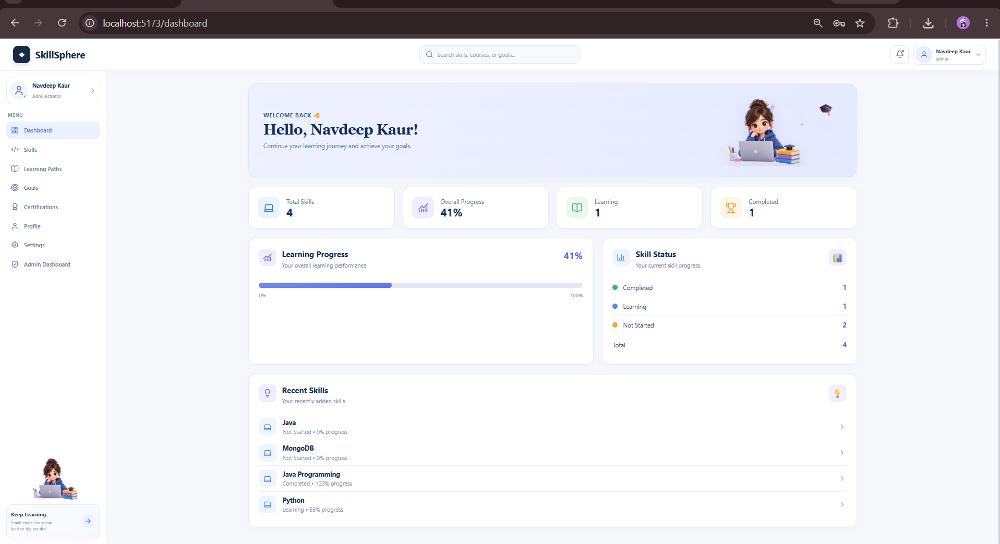
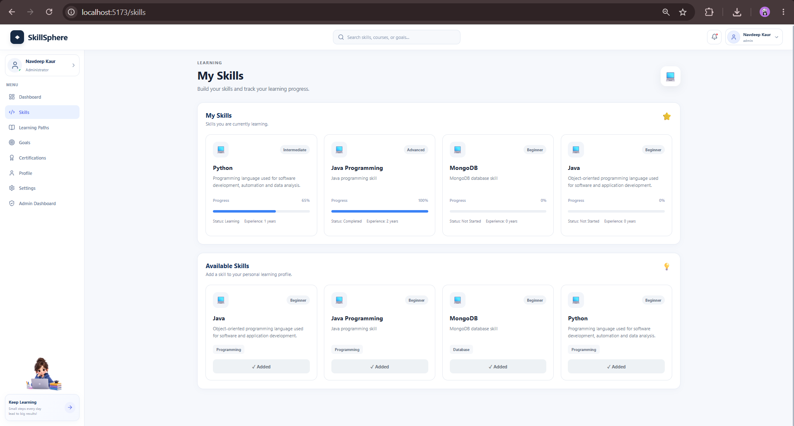
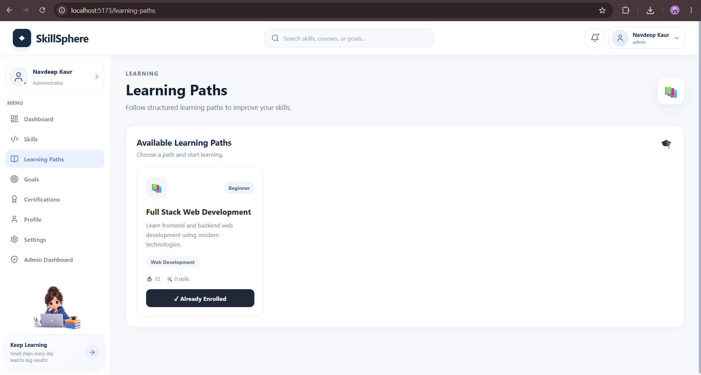
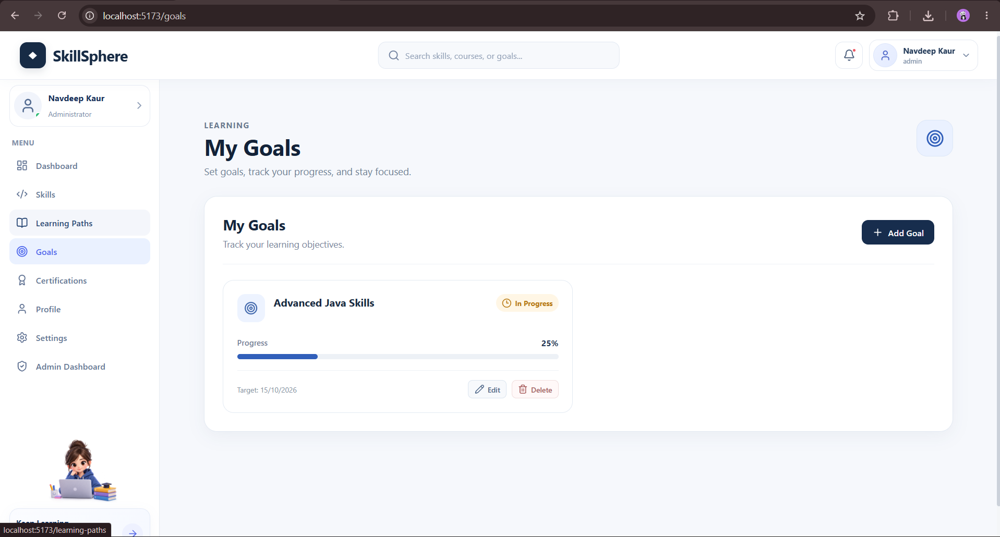
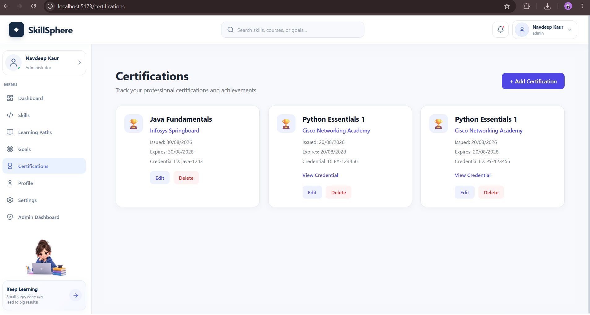
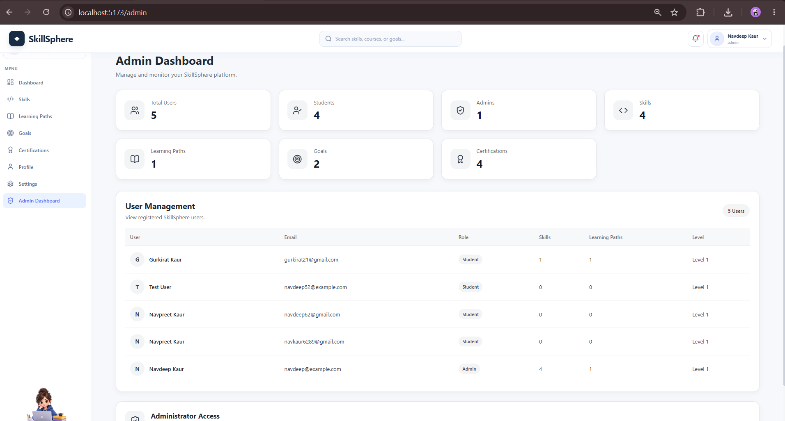

<div align="center">

# 🎓 SkillSphere

**A full-stack learning and certification progress tracking platform**

*Set goals. Track progress. Grow your skills.*

[](https://reactjs.org/)
[](https://nodejs.org/)
[](https://expressjs.com/)
[](https://www.mongodb.com/)
[](https://jwt.io/)
[](https://vitejs.dev/)

</div>

---

## 📖 About

**SkillSphere** helps students manage their skills, learning paths, goals, and certifications from a single dashboard. Built as a practical demonstration of modern full-stack development, it covers everything from authentication and role-based access control to real-time progress tracking — all in one cohesive application.

---

## 📸 Screenshots

### 🔐 Login


### 📊 Dashboard


### 💡 Skills


### 📚 Learning Paths


### 🎯 Goals


### 🏆 Certifications


### 🛡️ Admin Dashboard


---

## ✨ Features

<table>
<tr>
<td>

**🔐 Auth & Security**
- JWT-based login & registration
- Secure password handling
- Protected routes
- Role-based access (Student / Admin)
- Automatic login after registration

</td>
<td>

**📊 Dashboard**
- Personalized welcome & overview
- Skills and progress summary
- Learning path statistics
- Goals and certification counts

</td>
</tr>
<tr>
<td>

**💡 Skills Management**
- Add and track skills
- Monitor skill level & progress
- Log experience per skill

</td>
<td>

**📚 Learning Paths**
- Create and manage learning paths
- Track completion progress
- View enrolled users (admin)

</td>
</tr>
<tr>
<td>

**🎯 Goals**
- Create personal learning goals
- Track completion status
- Set and monitor target dates

</td>
<td>

**🏆 Certifications**
- Add and manage certifications
- View certification details
- Maintain records

</td>
</tr>
<tr>
<td>

**👤 Profile & Settings**
- Update name, bio, and info
- Change password
- View personal skills & progress

</td>
<td>

**🛡️ Admin Dashboard**
- Platform-wide statistics
- User management
- Monitor skills, paths, goals, certifications

</td>
</tr>
</table>

---

## 🛠️ Tech Stack

| Layer | Technology |
|---|---|
| **Frontend** | React.js, Vite, React Router, Axios, Lucide React, CSS |
| **Backend** | Node.js, Express.js, Mongoose, JWT |
| **Database** | MongoDB |
| **Dev Tools** | Git, GitHub, Postman, VS Code |

---

## 🏗️ Project Structure

```
SkillSphere/
│
├── Client/
│   ├── src/
│   │   ├── components/
│   │   ├── context/
│   │   ├── pages/
│   │   ├── services/
│   │   ├── App.jsx
│   │   ├── main.jsx
│   │   └── index.css
│   ├── public/
│   ├── package.json
│   └── vite.config.js
│
├── Server/
│   ├── controllers/
│   ├── middleware/
│   ├── models/
│   ├── routes/
│   ├── config/
│   ├── server.js
│   └── package.json
│
├── screenshots/
└── README.md
```

---

## 🔄 Application Flow

```
User
 │
 ▼
React Frontend  ──(Axios / REST API)──▶  Express.js Backend
                                               │
                                    ┌──────────┼──────────┐
                                    │          │          │
                                  JWT      API Routes  Business
                                 Auth                   Logic
                                    │
                                    ▼
                              MongoDB Database
```

---

## 🔑 Authentication Flow

```
Register / Login
      │
      ▼
Backend Validates Credentials
      │
      ▼
JWT Token Generated & Sent
      │
      ▼
Token Stored on Client
      │
      ▼
Token Attached to Every Protected Request
      │
      ▼
Authenticated & Authorized User
```

---

## 📌 Routes

| Route | Description |
|---|---|
| `/login` | User login |
| `/register` | New user registration |
| `/dashboard` | Personalized dashboard |
| `/skills` | Skills management |
| `/learning-paths` | Learning path management |
| `/goals` | Learning goals |
| `/certifications` | Certifications |
| `/profile` | User profile |
| `/settings` | Account settings |
| `/admin-dashboard` | Admin-only dashboard |

---

## 🔌 API Modules

```
/api/auth           → Registration, login, token management
/api/users          → User profile and settings
/api/skills         → Skill CRUD operations
/api/dashboard      → Dashboard statistics
/api/learning-paths → Learning path management
/api/goals          → Goal tracking
/api/certifications → Certification records
/api/admin          → Admin-only operations
```

---

## ⚙️ Getting Started

### Prerequisites

- Node.js (v18+)
- MongoDB Atlas account (or local MongoDB)
- Git

### 1. Clone the Repository

```bash
git clone https://github.com/navkaur62/SkillSphere.git
cd SkillSphere
```

### 2. Frontend Setup

```bash
cd Client
npm install
npm run dev
```

The frontend runs on `http://localhost:5173`

### 3. Backend Setup

Open a new terminal:

```bash
cd Server
npm install
```

Create a `.env` file inside the `Server` folder:

```env
PORT=5000
MONGO_URI=your_mongodb_connection_string
JWT_SECRET=your_jwt_secret
```

Then start the server:

```bash
npm start
```

The backend runs on `http://localhost:5000`

---

## 🔒 Environment Variables

| Variable | Description |
|---|---|
| `PORT` | Backend server port (default: 5000) |
| `MONGO_URI` | MongoDB connection string |
| `JWT_SECRET` | Secret key for signing JWT tokens |

> ⚠️ **Never commit your `.env` file.** Make sure it's listed in `.gitignore`.

---

## 🧪 API Testing with Postman

**Login request:**

```http
POST /api/auth/login
Content-Type: application/json

{
  "email": "user@example.com",
  "password": "your_password"
}
```

**Authenticated requests** use a Bearer token:

```
Authorization: Bearer <your_token>
```

---

## 📈 Key Learning Outcomes

Building SkillSphere provided hands-on experience with:

- Full-stack React + Node.js application architecture
- REST API design and development
- JWT authentication and protected routes
- Role-based authorization (Student vs Admin)
- MongoDB schemas with Mongoose
- React Context for state management
- Axios for API integration
- CRUD operations across multiple resources
- Modular backend structure
- Git & GitHub for version control
- Debugging with Postman

---

## 🔮 Future Enhancements

- [ ] Progress charts and analytics
- [ ] Course recommendations engine
- [ ] Skill assessment quizzes
- [ ] Certification reminders and notifications
- [ ] Learning streak tracking
- [ ] Advanced search and filtering
- [ ] File upload for certification documents
- [ ] Email notifications
- [ ] Production deployment (Render / Vercel + Atlas)

---

## 👩‍💻 Developer

**Navdeep Kaur**

B.Tech CSE — Specialization: IoT, Cyber Security & Blockchain

Passionate about **Full-Stack Development, Cybersecurity, IoT, and Blockchain**.

🔗 GitHub: [github.com/navkaur62](https://github.com/navkaur62)

---

## 📄 License

This project is developed for educational and portfolio purposes.

---

<div align="center">

**⭐ If you found this project helpful, give it a star!**

*Built with React + Node.js + Express.js + MongoDB + JWT*

</div>